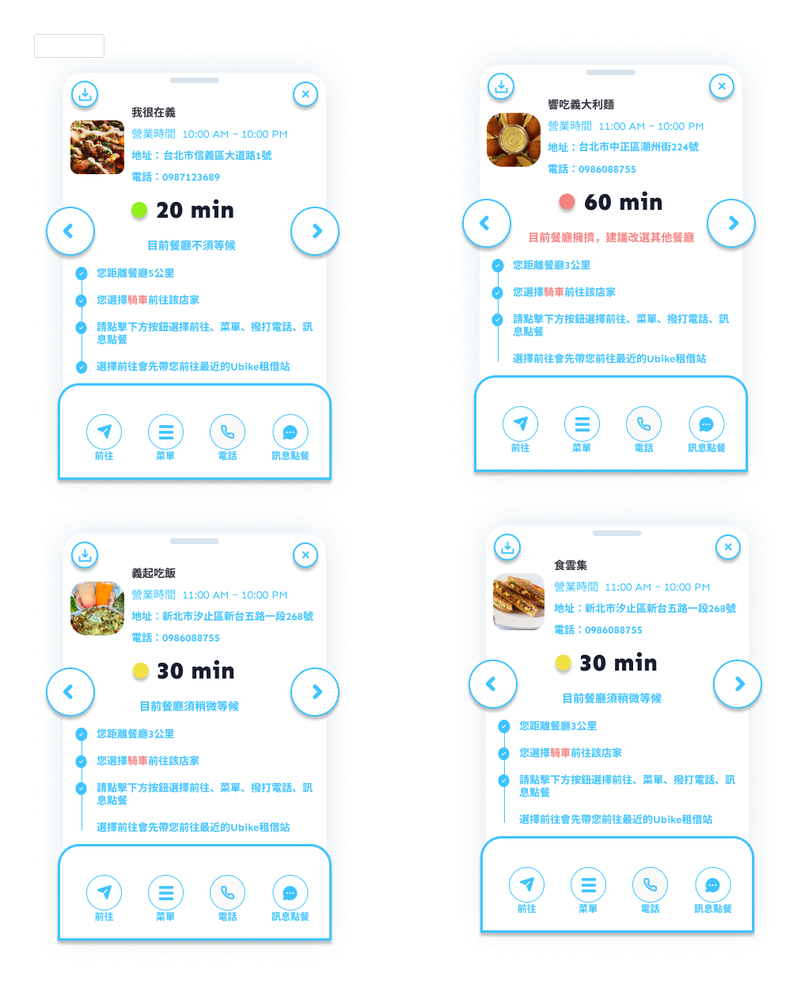

# Taipei flavorful App

這是一個簡單的應用程式,主要有三個頁面:主頁、設定頁和關於頁。

## 進入以及登入頁面

    
    

## 主頁
**操作流程**:

1. 主頁包含設定、搜尋、兌換、使用者資訊以及餐廳資訊

    
    
    
    

##餐廳資訊##
**操作流程**:
1. 通過點選主頁中的餐廳資訊來獲得詳細的資訊

##搜尋介面##
**操作流程**:
1. 通過點選主頁中的放大鏡，可以利用篩選會是直接搜尋餐廳名來獲取資訊

##兌換介面##
**操作流程**:
1. 點選下方禮物進入，可以兌換商品

    
    

##設定介面##
**操作流程**:
1. 點選下方人物圖示進入，可以設定各個功能並修改使用者資訊

    
    
    

