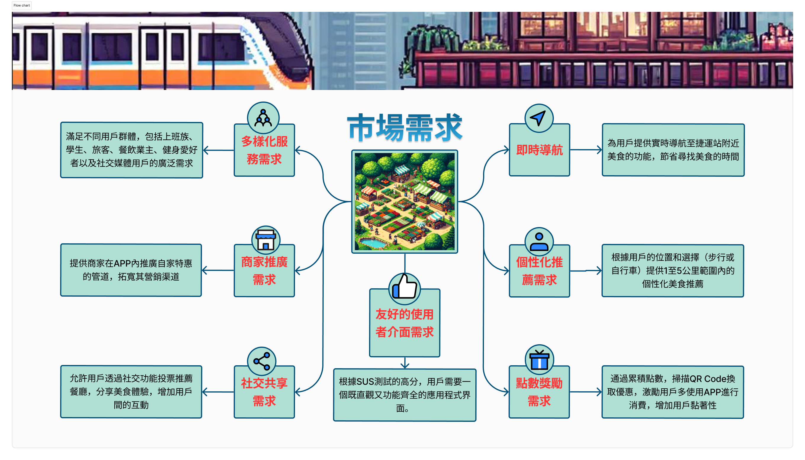
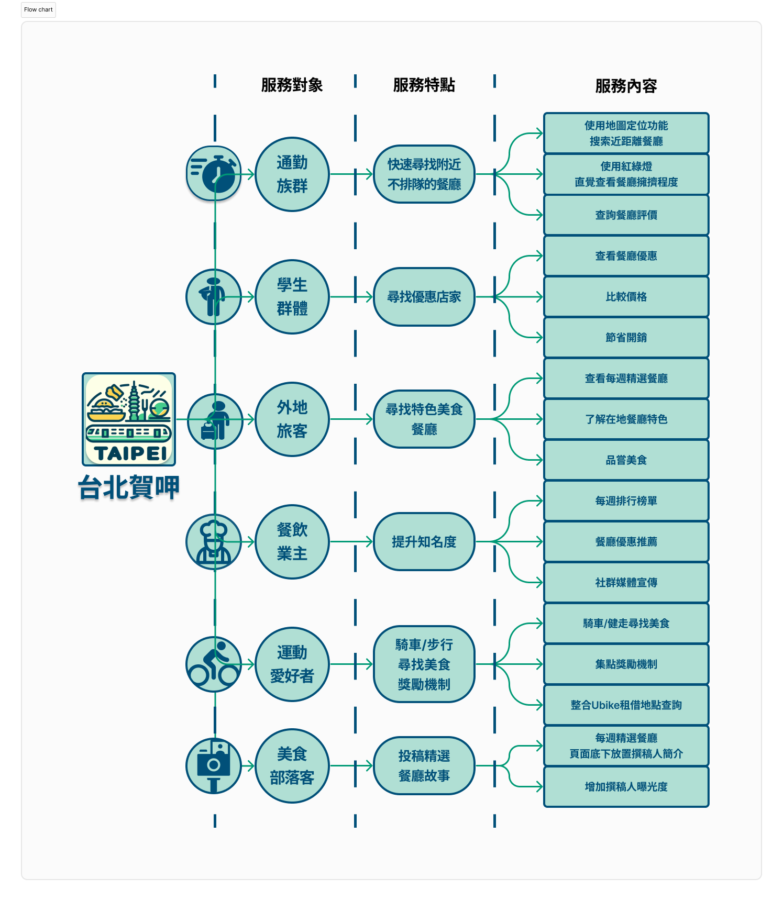
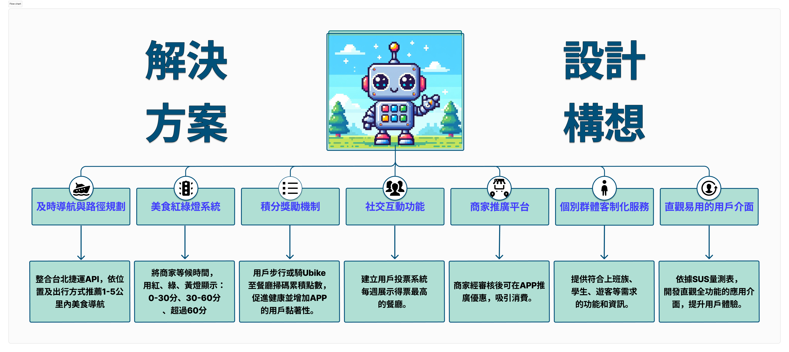
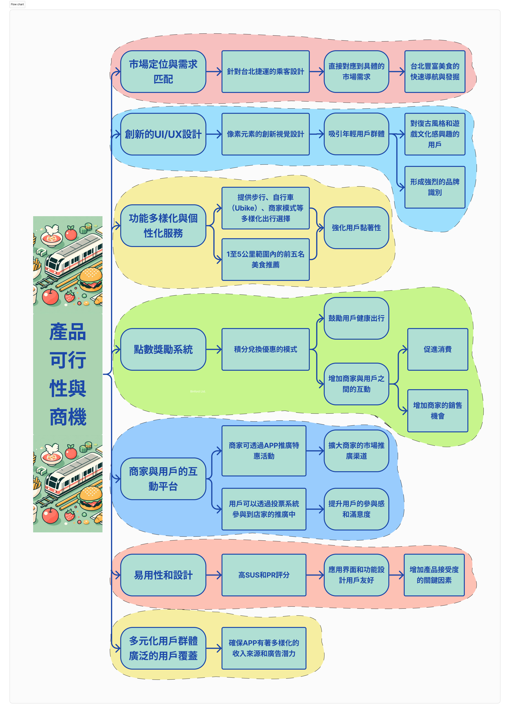
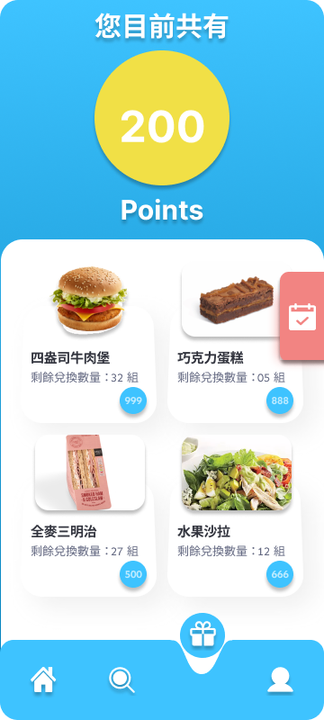
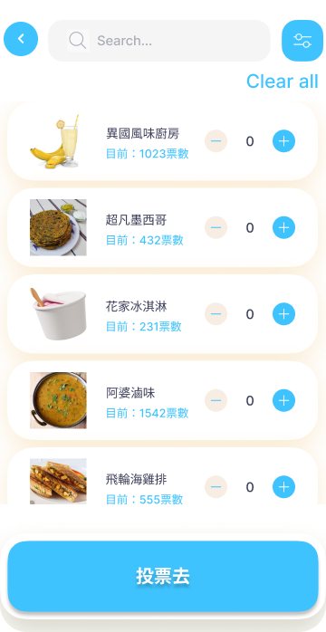

# Taipei flavorful App

## 市場需求

## 服務對象

## 解決方案

## 商品可行性與商機

## 進入以及登入頁面

    
    

## 主頁
**操作流程**:

1. 主頁包含設定、搜尋、兌換、使用者資訊以及餐廳資訊

    
    
    
    

## 餐廳資訊
**操作流程**:
1. 通過點選主頁中的餐廳資訊來獲得詳細的資訊

## 搜尋介面
**操作流程**:
1. 通過點選主頁中的放大鏡，可以利用篩選會是直接搜尋餐廳名來獲取資訊

## 兌換介面
**操作流程**:
1. 點選下方禮物進入，可以兌換商品

    
    

## 設定介面
**操作流程**:
1. 點選下方人物圖示進入，可以設定各個功能並修改使用者資訊

    
    
    

## 投票介面
**操作流程**:
1. 點選餐廳進行投票

    

## 訊息點餐介面
**操作流程**:
1. 點選餐廳並利用訊息進行點餐

    

